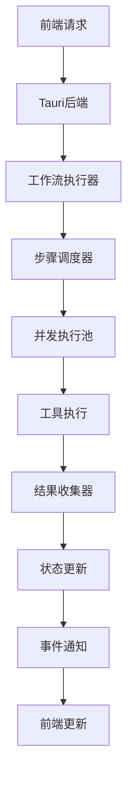
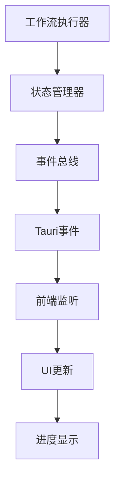

# 工作流异步响应机制架构分析

## 当前系统架构

### 前端组件 (alou-desktop/src)
- **AgentChat.jsx**: 主聊天界面组件
- **useAgentWorkflow.js**: 工作流管理Hook
- **useWorkflow.js**: 核心工作流逻辑Hook
- **WorkflowSkill.js**: Claude可调用的工作流技能
- **workflowService.js**: 前端工作流服务，调用Tauri后端

### Tauri后端 (alou-desktop/src-tauri/src)
- **workflow.rs**: 基础工作流CRUD操作
- **main.rs**: Tauri应用入口，注册工作流命令
- **tools/**: 工具系统架构

### Edge API (alou-edge/src)
- **agent.rs**: 智能体管理，支持异步批量操作
- **router/**: 各种API路由处理

## 当前问题分析

### 1. 同步执行限制
- 当前`execute_workflow`函数立即返回结果
- 没有真正的异步执行机制
- 无法处理长时间运行的工作流

### 2. 缺乏实时反馈
- 前端无法获取执行进度
- 用户不知道当前执行状态
- 没有步骤级别的状态更新

### 3. 聊天集成不完整
- 工作流消息与聊天流分离
- 状态同步机制不完善
- UI反馈不够直观

## 架构改进方案

### 异步执行架构

### 实时通信机制

### 组件集成方案

1. **异步执行器**: 替换同步执行逻辑
2. **状态持久化**: 保存执行状态到本地存储
3. **事件系统**: 实时通知前端状态变化
4. **UI增强**: 添加进度条和状态指示器
5. **错误处理**: 自动重试和手动干预机制

## 实施计划

### Phase 1: 核心异步机制
1. 实现异步工作流执行器
2. 添加状态管理和持久化
3. 建立事件通知系统

### Phase 2: 前端集成
1. 增强UI组件支持实时更新
2. 改进聊天框工作流集成
3. 添加进度可视化

### Phase 3: 高级功能
1. 并发执行优化
2. 错误恢复机制
3. 监控和日志系统

## 技术选择

- **异步运行时**: Tokio (已在Tauri中使用)
- **状态存储**: SQLite或文件系统持久化
- **事件系统**: Tauri内置事件系统
- **进度通知**: WebSocket或轮询机制
- **错误处理**: 指数退避重试策略